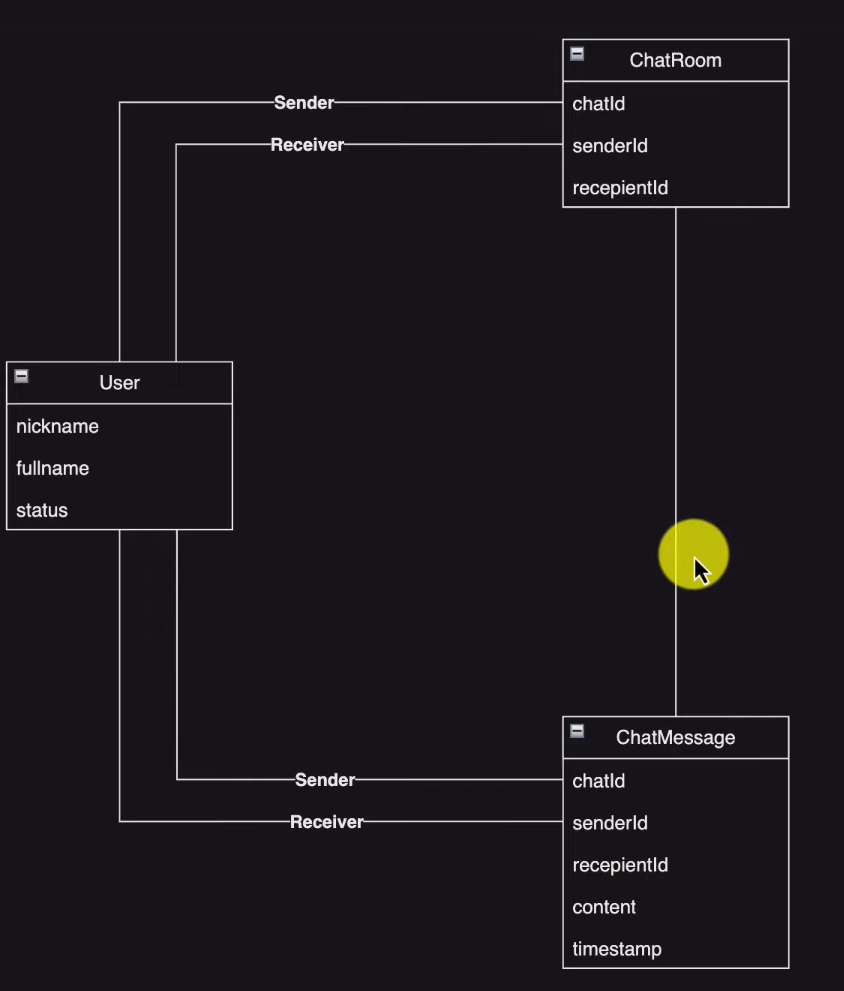

# Cách xây dựng Chat Application 1 - 1
## Dùng message broker để xây dựng
* 
  * Các tin nhắn đến người dùng A thì sẽ được gửi đến topic /user/A/queue/messages 
  * Khi tin nhắn đến user thì nó sẽ được lưu trong ChatMessage (có thể tạo ChatRoom nếu chưa tồn tại)\

* Thiết kế database (MongoDB)
  * 